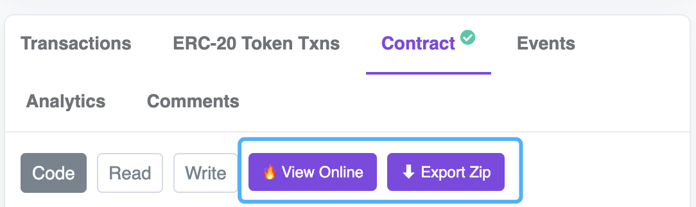

# contractscan

contractscan 是一个专为合约初学者打造的油猴脚本，能够让用户在主流公链上查阅合约代码时，一键在线编辑和自动打包代码并下载

## 实现原理
1. 通过用户前端直接发送代码查看请求，绕开平台反爬虫机制，获得合约代码及对应文件名
2. 后端对合约代码进行预处理（引用路径转换），将所有文件移至根目录，并打包提交至 Github
3. 利用 github.dev 实现代码在线编辑

## 支持网站
- *.etherscan.io
- *.bscscan.com
- *.polygonscan.com

## 使用方法

在合约代码查看页面，新增了如下图所示的两个新功能：
1. `View Online` 在 github.dev 编辑器中查看和编辑
2. `Export Zip` 打包下载该合约代码

## 特别鸣谢

  
  
    
  

